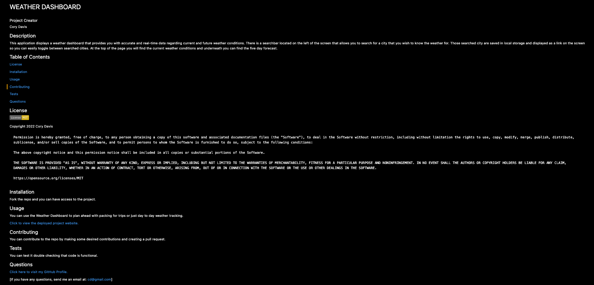

# README Generator Project

### Project Creator
Cory Davis

## Description
This project provides a template to create professional standard README files VERY quickly. The user, simply, runs the application using the `node index` command and then follows the question prompts until the completion of the inquiry. Once finished, a new README file is generated, saved in the Develop folder and is ready to use.

### Link to GitHub repository
https://github.com/cmd0160/README-Generator

## Generated README

